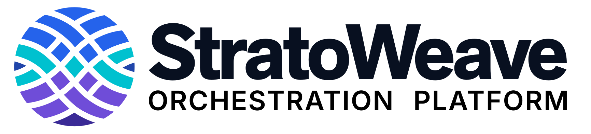

  <a href="https://www.stratoweave.org/">
    <picture>
      <source media="(prefers-color-scheme: dark)" srcset="docs/images/stratoweave-logo-dark.svg">
      
    </picture>
  </a>

StratoWeave is an open-source platform for building intent-based network
orchestration systems. It combines YANG models, layered declarative transforms,
and streaming telemetry to turn service intent into device configuration and
respond to changes in the network.

Visit **[www.stratoweave.org](https://www.stratoweave.org/)** for more information,
including tutorials, documentation, and community resources.

## How it works

You define the service abstractions and transformation logic for your network;
StratoWeave coordinates configuration updates through the layers and applies the
result through device adapters.

- **Model the system in YANG.** A system specification selects the service
  layers, their YANG modules, and the device types. Layers can range from
  customer-facing services to vendor-neutral network resources and vendor
  device models. YANG models become Acton types, allowing the compiler to catch
  data and type errors in your transforms.
- **Compose declarative transforms.** A transform maps YANG-modeled input to
  YANG-modeled output for the layer below. It describes the desired result and
  owns its configuration for as long as its intent exists. The platform handles
  updates and removal without separate create, update, and delete workflows.
- **React to operational state.** Configuration changes and telemetry updates
  drive the platform. Transform actors can subscribe to device or service state,
  publish service health, and coordinate multi-step procedures, enabling
  closed-loop automation at any layer.
- **Connect through modeled interfaces.** Northbound NETCONF and RESTCONF APIs
  expose YANG-modeled services. Southbound adapters apply device configuration
  and collect operational state, keeping protocol and device details separate
  from service logic.

## Getting started

Follow the [tutorials on the website](https://www.stratoweave.org/tutorials/)
in order:

1. **[Explore the web UI](https://www.stratoweave.org/tutorials/exploring-the-webui/)**
   — try the interactive SORESPO demo in your browser, with no installation.
2. **[Run SORESPO](https://www.stratoweave.org/tutorials/running-sorespo/)**
   — launch a live containerized Nokia SR Linux network and work through the
   web UI or equivalent terminal commands.
3. **[Develop SORESPO](https://www.stratoweave.org/tutorials/developing-sorespo/)**
   — install the Acton toolchain, change YANG models and transforms, and apply
   your build in the lab.

The running and development guides include instructions for Linux, macOS,
Windows with WSL2, and GitHub Codespaces.

## Community and contributions

StratoWeave is a Linux Foundation Networking project. Visit the
[community page](https://www.stratoweave.org/community/) to get involved, and
read [CONTRIBUTING.md](CONTRIBUTING.md) when you are ready to contribute to the
platform.
