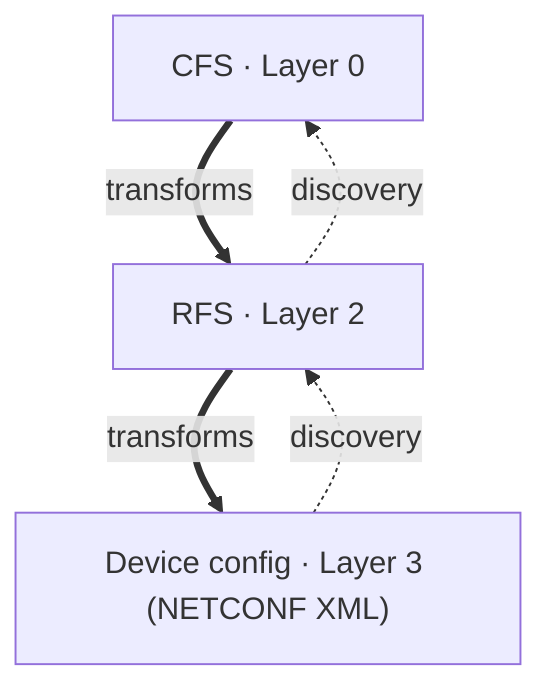

# Service discovery

A StratoWeave system normally runs *top-down*: service intent enters at the
customer-facing layer and a stack of [transforms](transforms.md) decomposes it,
layer by layer, into per-device configuration that is pushed south over NETCONF.

**Service discovery** is the same pipeline run in reverse. It starts from the
configuration that already exists on the devices and reconstructs the
higher-layer service data that *would have produced* it. Discovery is how you
onboard a brownfield network, migrate an existing deployment onto StratoWeave,
or simply check that a service model can faithfully represent what is really out
there.

The important property is that discovery needs **nothing but the device
configuration as NETCONF XML**. It never connects to a device, so you can run it
on a laptop, in CI, or against an archived config backup. The rest of this page
explains how that works, using the discovery implementation in
[SORESPO](https://github.com/stratoweave/sorespo) as the reference example.

## Discovery is the transform pipeline in reverse

In SORESPO the transform stack has four layers: customer-facing service (CFS,
layer 0), an intermediate layer (layer 1), resource-facing service (RFS, layer 2), and the
device layer (layer 3). Transforms flow *down* the stack; discovery reconstructs
a chosen layer directly from device config.



SORESPO ships two discovery entry points that mirror this picture:

- **Discover to RFS** normalizes each device's config into one resource-facing
  service tree per device. This is the low-level step: it stays close to the
  device and does not yet aggregate anything across devices.
- **Discover to CFS** goes all the way to the top, reconstructing the
  customer-facing L3VPN service model. It first normalizes every device to RFS
  and then aggregates the per-device RFS data into end-to-end services.

## A discovery function is a pure function

Like a [transform function](transforms.md#the-transform-function), a discovery
function is a **pure function**: it takes parsed device configuration and
returns service-layer data, with no side effects, no I/O, and no device access.

The test harness accepts any function with this shape:

```acton
proc(dict[str, gdata.Node]) -> gdata.Node
```

The SORESPO discovery functions are declared with `#!acton def`, so they are
genuinely pure. The input maps each device name to that device's configuration,
already parsed into a
`#!acton yang.gdata.Node`, and the output is the discovered layer as gdata, ready
to be applied through the normal layer stack. Because the function is pure, the
same set of XML snapshots always discovers the same service data, which is
exactly what makes discovery deterministic and snapshot-testable.

In SORESPO the two functions live under `src/sorespo/discovery/`:

```acton title="src/sorespo/discovery/rfs_discovery.act"
def discover_rfs_root(devices: dict[str, gdata.Node],
                      authentication_key_hints: list[str]) -> rfs_layer.root:
    ...

def discover_rfs(devices: dict[str, gdata.Node],
                 authentication_key_hints: list[str]) -> gdata.Node:
    return discover_rfs_root(devices, authentication_key_hints).to_gdata()
```

```acton title="src/sorespo/discovery/cfs_discovery.act"
def discover(devices: dict[str, gdata.Node],
             authentication_key_hints: list[str]) -> gdata.Node:
    cfs_root = cfs_layer.root()
    rfs_root = rfsd.discover_rfs_root(devices, authentication_key_hints)
    ...
    return cfs_root.to_gdata()
```

`discover_rfs_root(...)` builds the typed RFS tree, `discover_rfs(...)` returns
the same data as gdata for the test rig, and `cfs_discovery.discover(...)` reuses
`discover_rfs_root(...)` before aggregating up to the CFS layer. The
`authentication_key_hints` argument is a SORESPO-specific detail covered
[below](#recovering-encrypted-secrets); the discovery *contract* the test
framework cares about is only the `dict[str, gdata.Node] -> gdata.Node` shape.

## Service discovery runs completely offline

Everything you need for discovery is a set of NETCONF configuration snapshots — one
XML file per device. Each file is exactly what a `#!xml <get-config>` reply (or a
config backup, or `show running-config | display xml`) gives you:

```xml title="test/sd/CiscoIosXr_25_3_1/AMS-CORE-1.xml"
<data>
  <hostname xmlns="http://cisco.com/ns/yang/Cisco-IOS-XR-um-hostname-cfg">
    <system-network-name>AMS-CORE-1</system-network-name>
  </hostname>
  <interfaces xmlns="http://cisco.com/ns/yang/Cisco-IOS-XR-um-interface-cfg">
    <interface>
      <interface-name>GigabitEthernet0/0/0/0</interface-name>
      <description>Link to FRA-CORE-1 [GigabitEthernet0/0/0/0]</description>
      <ipv4>
        <addresses xmlns="http://cisco.com/ns/yang/Cisco-IOS-XR-um-if-ip-address-cfg">
          <address>
            <address>10.0.7.1</address>
            <netmask>255.255.255.252</netmask>
          </address>
        </addresses>
      </ipv4>
    </interface>
    <!-- ... -->
  </interfaces>
</data>
```

The device-type YANG schemas needed to parse that XML into typed gdata are
compiled into the [system specification](system-spec.md), so parsing is offline
too. Nothing in the discovery path opens a socket:

- The `discover` function is pure and is called as an ordinary function — it
  only reads parsed trees.
- Its input is read from files, not from devices.
- When the discovered data is applied to validate it (see
  [Testing service discovery](#testing-service-discovery)), the layer stack is
  built **without a network connect capability**, so the device layer falls back
  to mock adapters instead of dialing out. Discovery deliberately marks every
  device it creates as a mock device for exactly this reason.

!!! tip "All you need is the XML"
    To discover services from a real network you do not need reachability,
    credentials, or a lab. Capture each device's configuration as NETCONF XML
    once — however you like — drop the files into a directory, and run
    discovery against them. The same run works identically on a developer laptop
    and in CI.

## How discovery reconstructs intent

The RFS discovery stage does the heavy lifting: it reads each device's config
and extracts base config, backbone interfaces, iBGP neighbors, VRFs, VRF
interfaces, and eBGP customers into an RFS tree. The CFS stage then consumes that
normalized RFS data — it does not read device-specific config directly — to
build backbone links and the end-to-end L3VPN service model.

Applied to the four SORESPO device configurations, discovering to RFS reconstructs data like
this:

```text title="Discovered layer 2 (RFS) data"
rfs_element = l2.rfs.create('AMS-CORE-1')
rfs_element.base_config.role = 'edge'
rfs_element.base_config.ipv4_address = '10.0.0.1'
rfs_element.base_config.asn = u64(65001)

backbone_interface_element = rfs_element.backbone_interface.create('GigabitEthernet0/0/0/0',
    ipv4_address='10.0.7.1', ipv4_prefix_length=u64(30), monitor_traffic=False)
backbone_interface_element.remote.device = 'FRA-CORE-1'
backbone_interface_element.remote.interface = 'GigabitEthernet0/0/0/0'

ibgp_neighbor_element = rfs_element.ibgp_neighbor.create('10.0.0.2', asn=u64(65001), description='FRA-CORE-1')
```

Discovering to CFS goes further and rebuilds the customer-facing IETF L3VPN
service (RFC 8299) — VPN services, sites, and site network accesses — purely
from what the devices reveal:

```text title="Discovered layer 0 (CFS) data"
vpn_service_element = l0.l3vpn_svc.vpn_services.vpn_service.create('acme-65501', customer_name='acme')

site_element = l0.l3vpn_svc.sites.site.create('SITE-1')
site_network_access_element = site_element.site_network_accesses.site_network_access.create('SNA-1-1')
site_network_access_element.bearer.bearer_reference = 'AMS-CORE-1,GigabitEthernet0/0/0/2.100'
```

### Detecting the device type

Discovery re-detects each device's type from the parsed tree by probing for a
top-level container in a vendor-specific namespace. This keeps the discovery
logic independent of the platform:

```acton title="src/sorespo/discovery/rfs_discovery.act"
def get_device_type(dev: gdata.Node) -> ?str:
    """Resolve a parsed config to its sysspec device type."""
    if dev.get_opt_cnt(gdata.Id(xr25.NS_Cisco_IOS_XR_um_hostname_cfg, "hostname")) is not None:
        return DEV_TYPE_XR
    if dev.get_opt_cnt(gdata.Id(crpd24.NS_junos_conf_root, "configuration")) is not None:
        return DEV_TYPE_CRPD
    if dev.get_opt_cnt(gdata.Id(srl25.NS_srl_nokia_system, "system")) is not None:
        return DEV_TYPE_SRL
    return None
```

Much of the remaining discovery logic recovers intent that the device config
only carries by *convention* — for example SORESPO encodes topology and customer
metadata in interface descriptions such as
`Link to FRA-CORE-1 [GigabitEthernet0/0/0/0]` and
`Customer VPN access SITE-1 [SNA-1-1] in VPN acme-65501`, and derives router IDs
from the loopback address. Those conventions are project-specific; the pattern to
copy is that they live in the discovery code, not in the device.

### Recovering encrypted secrets

Device config stores secrets encrypted (Cisco type-7, Junos `#!text $9$…`), and
discovery cannot decrypt them. Instead the caller supplies a list of candidate
plaintext **hints**; discovery re-encrypts each hint with the on-device salt and
matches the ciphertext to recover the plaintext.

```acton title="src/sorespo/test_discovery.act"
# Candidate plaintext keys discovery tries against the encrypted iBGP and eBGP
# secrets found on-device: the iBGP mesh key and the customer's eBGP session key.
_AUTHENTICATION_KEY_HINTS: list[str] = ["ibgp-authentication-key", "acme-bgp-md5"]
```

If a snapshot contains an encrypted key with no matching hint, discovery raises
an error, so extend the hint list whenever you add a device whose secrets are
not yet covered.

!!! info "Keep device-specific reads in RFS discovery"
    When you add discovery support for a new device type or service, branch on
    the device type inside the RFS discovery functions and keep all
    vendor-specific reads there. CFS discovery should only ever consume the
    normalized RFS data. This is the same separation of concerns that the
    [RFS transform](transforms.md#the-rfs-transform-function) layer enforces in the
    forward direction.

## Testing service discovery

StratoWeave ships a dedicated test harness,
`#!acton stratoweave.test_rig.ServiceDiscoveryTester`, that turns a directory of
device snapshots plus a `discover` function into a full round-trip test. It
follows the standard Acton [testing](testing.md) model, so it runs under
`acton test` alongside every other test.

```acton title="src/sorespo/test_discovery.act"
import testing
import stratoweave.test_rig as swts

import sorespo.sysspec as sysspec
import sorespo.discovery.cfs_discovery as cfsd
import sorespo.discovery.rfs_discovery as rfsd

_AUTHENTICATION_KEY_HINTS: list[str] = ["ibgp-authentication-key", "acme-bgp-md5"]

def _discover_cfs(devices):
    return cfsd.discover(devices, _AUTHENTICATION_KEY_HINTS)

def _discover_rfs(devices):
    return rfsd.discover_rfs(devices, _AUTHENTICATION_KEY_HINTS)

actor _test_sd_to_cfs(t: testing.EnvT):
    swts.ServiceDiscoveryTester(t, sysspec.SYSSPEC, "test/sd", _discover_cfs)

actor _test_sd_to_rfs(t: testing.EnvT):
    swts.ServiceDiscoveryTester(t, sysspec.SYSSPEC, "test/sd", _discover_rfs, layer_depth=2)
```

The small `_discover_cfs` / `_discover_rfs` wrappers exist only to bake the
authentication-key hints in and expose the plain
`#!acton dict[str, gdata.Node] -> gdata.Node` shape the tester expects.

The tester is constructed with the system spec, the snapshot directory, the
discovery function, and the layer at which to apply the result:

```acton
actor ServiceDiscoveryTester(
    t: testing.EnvT,
    sysspec: swapp.SysSpec,
    xml_dir: str,
    discover: proc(dict[str, gdata.Node]) -> gdata.Node,
    layer_depth: int = 0,
)
```

`layer_depth` defaults to `0`, the top (CFS) layer, so `_test_sd_to_cfs` needs
no explicit depth. `_test_sd_to_rfs` passes `layer_depth=2` to apply the
discovered data at the RFS layer instead. (Negative depths index from the bottom
of the stack, where `-1` is the device layer.)

### Laying out device snapshots

The tester scans `xml_dir` for one subdirectory per device type. Each
subdirectory name must match a key in `#!acton sysspec.SYSSPEC.device_types`, and
each `*.xml` file inside is parsed with that device type's bundled schema. The
file name without `.xml` becomes the device name and must be unique across all
subdirectories.

```text title="test/sd"
test/sd/
├── CiscoIosXr_25_3_1/
│   ├── AMS-CORE-1.xml
│   └── FRA-CORE-1.xml
└── JuniperCRPD_24_4R1_9/
    ├── LJU-CORE-1.xml
    └── STO-CORE-1.xml
```

### What the tester does

For each test, the harness performs the full offline round trip:

1. **Scan and parse.** It walks `xml_dir`, and for every `<device-type>/<name>.xml`
   file it looks up the device type in `sysspec.device_types` and parses the XML
   with that type's bundled YANG schema into a `#!acton gdata.Node`.
2. **Discover.** It builds the `#!acton dict[device-name, gdata.Node]` and calls
   your `discover` function, which returns the discovered layer as gdata.
3. **Apply.** It applies the discovered gdata at `layer_depth` through the
   standard layer stack. Because the rig is built without a network connect
   capability, the transforms below re-render device configuration against mock
   adapters — no device is contacted.
4. **Snapshot.** It reports a snapshot containing the discovered layer data plus
   a per-device round-trip diff.

### The round-trip diff

The snapshot's second section is the correctness check. After the discovered
intent has been re-rendered back down to device configuration, the tester diffs
that regenerated config against the *original* input snapshot for each device. A
result of `no diff` means discovery captured everything needed to reproduce the
device config exactly — the reconstructed intent is faithful. Any difference is
config that discovery failed to round-trip and is surfaced as XML.

```text title="snapshots/expected/sorespo.test_discovery/sd_to_rfs"
# === Layer 2 adata ===
l2 = root()
# ... discovered RFS data ...

# === Round-trip diff (per device) ===
# device AMS-CORE-1
no diff

# device FRA-CORE-1
no diff
```

Run the discovery tests together with the rest of the suite:

```sh
make test
```

If a snapshot changed intentionally — for example because you extended discovery
to capture more config — inspect `snapshots/output/...` against
`snapshots/expected/...` and accept it with `acton test --accept`, exactly as for
any other [snapshot test](testing.md).

## Adding discovery for a new device or service

1. Capture the device's running configuration as NETCONF XML and save it as
   `test/sd/<device-type>/<device-name>.xml`, where `<device-type>` matches a key
   in `sysspec.SYSSPEC.device_types`.
2. If the snapshot contains encrypted keys, add their plaintext values to the
   authentication-key hints.
3. Extend the RFS discovery functions to read the new device type or config,
   keeping all vendor-specific logic in the RFS stage and letting CFS discovery
   consume the normalized RFS data.
4. Run `make test` and review the discovered layer data and the per-device
   round-trip diff in the snapshot.
5. Improve the discovery code, or expand your service models and transforms,
   until the brownfield device config you intend to manage is fully covered.
6. Accept the snapshot once the diff is clean.

### Reaching zero diff on a real network

SORESPO's fixtures reach `no diff` immediately, but a real brownfield network
will not. Treat the round-trip diff as a **coverage metric**: it measures how
much of the live configuration your models and transforms can reproduce. The
first run will diff heavily — real devices carry config you have not modeled
yet, and **config drift** means devices that should match often do not.

Closing the gap is iterative. Each round, take the largest entry in the diff and
decide whether it is in scope:

- **In scope** — config the service should own. Read it in discovery, add nodes
  for it to your RFS/CFS YANG, and write the transform that regenerates it;
  discovery and transforms advance together.
- **Out of scope** — Consider reconciliation or cleanup of the device configuration

Repeat until every device reports `no diff`; a large network takes several
passes. Zero diff across the whole network means your models and transforms are
a faithful representation of what is really deployed.
